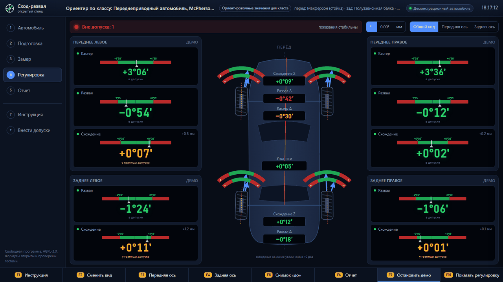
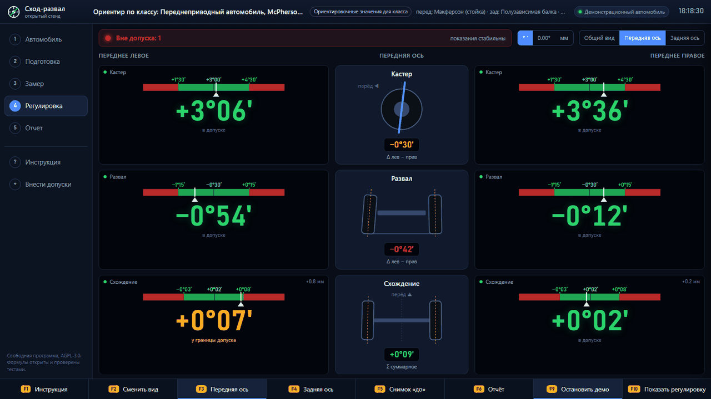
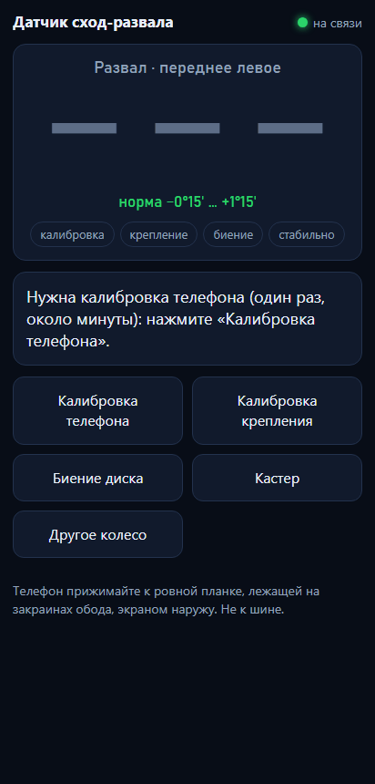
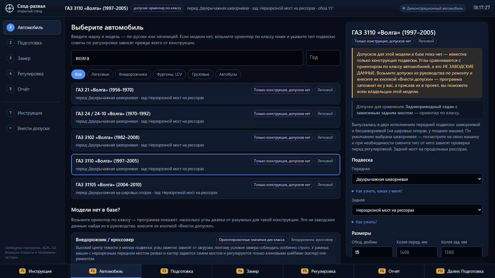
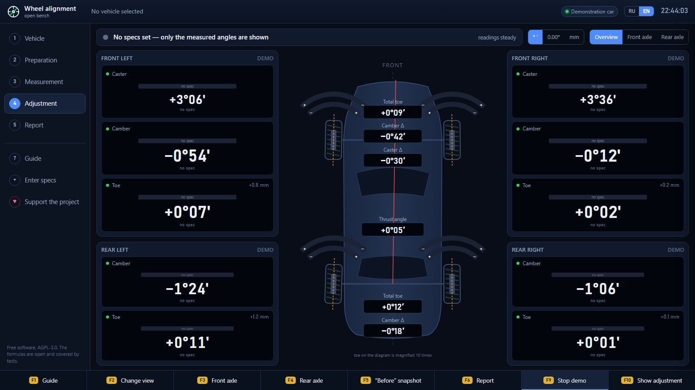
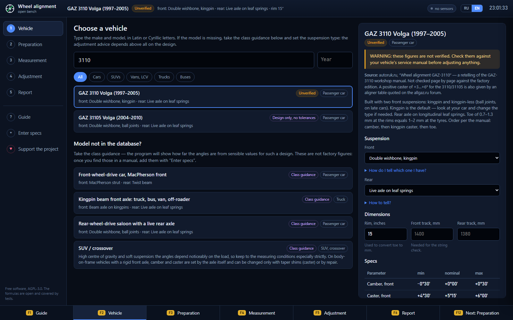

<a id="ru"></a>

**Русский** · [English](#eng)

# Сход-развал — открытый стенд

[](https://github.com/AristarhUcolov/wheel-alignment/actions/workflows/ci.yml)
[](LICENSE)
[](https://ko-fi.com/AristarhUcolov)

Свободная программа, чтобы сделать сход-развал **самому**: развал, схождение,
кастер, угол тяги — с экраном в реальном времени, как у профессионального
стенда, пошаговой инструкцией и советами под конструкцию именно вашей подвески.
Шкворневой или на шаровых опорах, легковой, грузовой или автобус.

Одна программа, без установки и без интернета — на любом ноутбуке в гараже.
Интерфейс на русском и английском: переключатель **RU / EN** в верхнем углу.



**Разделы:** [Зачем](#зачем) · [Скачать](#скачать-и-запустить) ·
[Как выглядит](#как-это-выглядит) · [Чем мерить](#чем-мерить) ·
[Типы подвески](#любая-машина-типы-подвески) · [База автомобилей](#база-автомобилей) ·
[Честно о допусках](#честно-о-допусках) · [Документация](#документация) ·
[Поддержать проект](#поддержать-проект) · [Лицензия](#лицензия)

---

## Зачем

Стенд сход-развала стоит как подержанный автомобиль. Поэтому владельцы старых
машин — «Волги» со шкворневой подвеской, УАЗа, «классики», грузовика —
регулярно слышат «на вашу машину нет данных», «шкворень не делаем» или платят за
работу, которую невозможно проверить. А дома люди мучаются с ниткой и рулеткой,
не зная, в каком порядке крутить и правильно ли посчитали.

Математика углов установки колёс открыта, ей больше ста лет. Оборудование можно
собрать из лески, двух листов жести и телефона. Чего не хватало — программы,
которая считает честно, показывает всё вживую и объясняет, что делать.

---

## Скачать и запустить

**Windows 10/11:** скачайте `wheelalign.exe` со страницы
[Releases](https://github.com/AristarhUcolov/wheel-alignment/releases) и
запустите. Программа откроется в своём окне на весь экран. Нажмите **F9** на
экране регулировки — запустится учебная машина, на которой можно освоить всё,
не залезая под настоящую. **F1** — подробная инструкция.

**Linux, macOS:** файл для вашей системы там же; интерфейс откроется в браузере.

**Из исходников** (нужен [Go](https://go.dev/dl/) 1.26):

```bash
git clone https://github.com/AristarhUcolov/wheel-alignment.git
cd wheel-alignment
go run ./cmd/wheelalign

# один файл без консольного окна — для флешки в гараж
go build -ldflags "-H=windowsgui" -o wheelalign.exe ./cmd/wheelalign
```

Ваши данные — свои допуски, калибровки телефонов, выбранный язык — хранятся в
профиле (`%APPDATA%\wheelalign` в Windows) и переживают обновления программы.

**Как пользоваться — по шагам:** [docs/GUIDE.md](docs/GUIDE.md).

---

## Как это выглядит

**Экран регулировки** — как у стенда. Крупные цифры: **зелёные — в допуске**,
янтарные — у границы, **красные — вне допуска**. Над каждой — шкала «красное |
зелёное | красное» с границами допуска и стрелкой текущего значения. На схеме
сверху колёса **поворачиваются вживую**, пока вы крутите тягу; дуговые шкалы над
колёсами — как на заводских стендах. В центре — суммарное схождение, разница
развала и кастера по бортам, угол тяги.



**F3 / F4 — передняя и задняя ось во весь экран**, чтобы читать из-под машины.

Нажмите на любой угол — справа откроется:

- куда и на сколько до номинала;
- **чем он регулируется на вашей машине** — по данным модели и по конструкции
  подвески (прокладки под осью рычага, эксцентрик, рулевая тяга, клин под
  рессору…) — или что штатной регулировки нет и надо искать деформацию;
- **помощник «сколько крутить»**: поверните тягу на четверть оборота, нажмите
  «¼» — программа узнает, сколько даёт оборот на вашей машине, и дальше
  подскажет: «до номинала ≈ 1¾ оборота — в ту же сторону».

Снимки «до» и «после» (**F5**) складываются в протокол (**F6**), который можно
распечатать или сохранить в PDF.

---

## Чем мерить

| Способ | Что нужно | Что даёт |
|---|---|---|
| **Струна и угломер** | Леска, рулетка, угломер | Развал, схождение, угол тяги; с поворотными кругами — кастер |
| **Телефон на колесе** | Любой смартфон с браузером | Развал в реальном времени по Wi-Fi; кастер по гироскопу |
| **Камера и мишени** | Фотоаппарат или телефон, распечатанные мишени | Развал, схождение, угол тяги |
| **Свой датчик** | ESP32, лазерный указатель — что угодно с JSON | Что умеет датчик — [протокол](docs/SENSORS.md) |

Способы сочетаются: развал и кастер телефоном, схождение струной — программа
сведёт всё на одном экране.

### Телефон как датчик



Телефон прикладывается к ровной планке на закраинах обода и передаёт развал в
реальном времени — стрелки на экране двигаются, пока вы крутите регулировку.
Приложение ставить не нужно: отсканируйте QR-код на экране компьютера.

Телефон **без калибровки** врёт на 0,5–2°: смещение нуля акселерометра больше
любого заводского допуска. Поэтому две однократные калибровки — на столе
(экраном вверх и вниз) и на планке (вертикально и вверх ногами). Первая
вычитает смещение нуля, вторая — перекос из-за выступа камеры и перекрёстную
чувствительность осей. Проверено на физической модели телефона со всеми этими
недостатками: ошибка развала — **0,02° СКО, 0,05° в худшем случае**.

**Кастер телефоном**: колёса на поворотных кругах, телефон ведёт по шагам
«прямо → наружу → внутрь», угол поворота меряет гироскоп (его собственный уход
измеряется в положении «прямо» и вычитается). Ровно 20° выдерживать не нужно:
программа решает задачу точно при любых двух углах поворота.

<br clear="right">

---

## Любая машина: типы подвески

Заводские допуски у каждой модели свои, а **конструкций подвески в мире около
дюжины** — и именно тип подвески определяет, что вообще можно отрегулировать,
чем, и что надо проверить до регулировки. Программа знает их все:

Макферсон · двухрычажная на шаровых опорах · **двухрычажная шкворневая** (ГАЗ-21,
24, 3102, 3110) · **неразрезная балка на шкворнях** (ГАЗель, ГАЗ-53, ЗИЛ, КамАЗ,
ПАЗ, УАЗ) · мост на шаровых опорах · многорычажная · полузависимая балка · мост на
рессорах · мост на пружинах и тягах · продольные и косые рычаги.

Для каждой — как узнать её на своей машине, что обычно регулируется и чем, куда
крутить, и **что проверить до регулировки**. Для шкворневой — люфт шкворней при
нажатой педали тормоза, осевой зазор кулака, резьбовые шарниры стоек, смазка:
именно из-за изношенных шкворней мастерские и отказываются. Для грузовиков и
автобусов — что развал балки не регулируется, кастер исправляют клиновыми
прокладками, а поперечная тяга задаёт только суммарное схождение.



---

## База автомобилей

**113 записей, 32 марки** — легковые, внедорожники, фургоны, грузовые и
автобусы: ГАЗ, ВАЗ (Lada), УАЗ, ЗИЛ, КамАЗ, МАЗ, Урал, ПАЗ, ЛиАЗ, Ikarus,
Москвич, BMW, Mercedes-Benz, Volkswagen, Ford, Chevrolet, Renault, Toyota,
Hyundai, Kia, Škoda, Audi, Opel, Peugeot, Nissan, Mitsubishi, Daewoo, MAN,
Scania, Volvo, DAF.

Каждая марка — свой файл в [`internal/specs/data/`](internal/specs/data):
`gaz.json`, `vaz.json`, `chevrolet.json`, `bmw.json`, `mercedes.json`,
`kamaz.json`… Внутри у каждой записи — конструкция подвески, годы, класс, текст
на двух языках и **источник**.

Допуски (не «ориентир по классу», а цифры конкретной модели) сейчас есть у
ГАЗ-3110, ГАЗели, УАЗ-469, ВАЗ-2101…2107, 2108/2109, 2110, «Нивы» 2121 и
Chevrolet Niva. Все они помечены **«не проверено»**: взяты из открытых
пересказов руководств по ремонту, у каждой есть ссылка на страницу, которую
можно открыть прямо из программы. Остальные модели — **только конструкция**:
программа знает их подвеску и даёт правильные советы, а углы сравнивает с
ориентиром по классу, прямо говоря об этом.

Почему не «все машины мира с цифрами» — ниже.

---

## Честно о допусках

Полная база заводских допусков всех автомобилей мира — это платный
коммерческий продукт (Autodata, Mitchell, ALLDATA, Hunter), и выдумывать цифры
нельзя: неверный угол развала — это съеденная за сезон резина и машина, которая
плохо ведёт себя в экстренной ситуации. Поэтому у каждой записи в программе
указан источник, и непроверенное нигде не выглядит как проверенное:

| Метка | Что значит |
|---|---|
| Заводское руководство | Сверено с документом, указаны издание и страница |
| Сообщество | Перепроверено по независимому источнику |
| Не проверено | Один источник; показывается с крупным предупреждением |
| Только конструкция | Модель в каталоге (подвеска, годы), допусков нет — сравнение с ориентиром по классу |
| Ориентир по классу | Типичные значения для конструкции — **не** для вашей модели |

Что это значит на практике:

- **Каталог.** Машину найдёт поиском по-русски и латиницей: «Волга 3110»,
  «газель», «УАЗ буханка», «Hilux». Советы и проверки подстроятся под её
  подвеску, а углы сравнятся с ориентиром по классу — с явной пометкой.
- **Свои допуски.** У вас есть руководство по ремонту? «Внести допуски» —
  программа подставит марку, модель и подвеску, поймёт углы в том виде, как они
  напечатаны («0°30'», «-0 30»), проверит на типовые опечатки, сохранит у вас и
  будет регулировать по ним.
- **Для всех.** Та же кнопка готовит файл для проекта. Одна проверенная запись
  помогает всем владельцам этой модели — навсегда. Правила —
  [docs/CONTRIBUTING-SPECS.md](docs/CONTRIBUTING-SPECS.md).

Проверка при переносе данных тоже работает: у ВАЗ-2107 в базе был кастер 3°…4°,
а в руководстве — 4°±30′ под нагрузкой; запись исправлена, и об этом сказано в
её источнике.

---

## Чем это отличается от обычного стенда

**Точный расчёт кастера.** Сервисные мануалы дают правило «кастер = размах
развала при повороте × 1,5». Это приближение первого порядка. На машинах с
кастером 6–8° — то есть почти на всём, что выпущено после 2000 года — оно
систематически врёт до **0,27°**, что больше заводского допуска у ряда моделей.
Программа решает задачу точно, через уравнение Родрига, и при любых двух углах
поворота — вывод в комментариях к `SweepReading.Solve`, проверка в тестах рядом.

**Честность про SAI.** Поперечный наклон оси, полученный из замера развала при
повороте, делится на `(1 − cos 20°) = 0,06`. Ошибка угломера 0,1° превращается
в **1,8°** SAI. Программа считает его, но прямо пишет, что пользоваться им
можно только для сравнения левого борта с правым.

**Проверка установки струн.** Народное правило «сделай отступы одинаковыми
спереди и сзади» верно только при равных колеях осей. У большинства машин они
разные, и программа считает правильную разницу: `(колея_зад − колея_перед) / 2`
— и говорит, на сколько миллиметров подвинуть каждый конец струны.

**Схождение от линии тяги.** Переднее схождение отсчитывается от направления, куда
едет задняя ось, — поэтому после регулировки руль стоит прямо, даже если задний
мост слегка повёрнут.

**Диагностика того, что не лечится регулировкой.** Разница включённого угла по
бортам, разная колёсная база, большой сдвиг колёс — программа отличает «погнуто»
от «разрегулировано».

**Оптика без OpenCV.** Детектор шахматной мишени, калибровка камеры по Чжану,
решение позы и связывание четырёх колёс напольными мишенями — всё своё, на Go,
проверено сквозными тестами от нарисованных пикселей до угла колеса. Подробно —
[docs/OPTICAL.md](docs/OPTICAL.md).

---

## Устройство программы

```
cmd/wheelalign/        точка входа: окно (WebView2) или браузер, профиль пользователя
internal/align/        углы, знаки, системы отсчёта, сборка протокола
internal/measure/      замеры → углы: струна, угломер, поворот колеса (кастер), оптика
internal/live/         реальное время: сглаживание, «успокоилось», кадры экрана, учебная машина
internal/phone/        телефон как датчик: калибровка, развал, кастер по гироскопу, HTTPS в сети
internal/suspension/   типы подвески: как узнать, что и чем регулируется, что проверить
internal/specs/        база автомобилей (файл на марку), происхождение данных, свои допуски
internal/vision/       камера, мишени, PnP, калибровка, связывание колёс
internal/i18n/         русский и английский: ключ — русская строка, тест ловит непереведённое
internal/desktop/      язык системы, настройки, открытие ссылок в браузере
internal/geom, numeric линейная алгебра, МНК, Левенберг–Марквардт
internal/server/       HTTP API и интерфейс (встроен в программу)
```

**Ключевое разделение:** `align` знает только про оси вращения колёс. Откуда они
взялись — камера, телефон, струна или угломер — ему безразлично. Живой экран и
печатный отчёт считают производные величины одинаково и берут допуски через одну
и ту же функцию; тесты сверяют их до последнего знака.

---

## Документация

- [**Инструкция: как пользоваться программой**](docs/GUIDE.md) — от установки
  до протокола, каждый экран и способ замера, типичные неполадки.
- [Полная процедура для гаража](docs/PROCEDURE.md) — инструмент, площадка,
  замеры струной, угломером и телефоном, порядок регулировки, шкворневые
  подвески и грузовики, точность, безопасность.
- [Свой датчик: открытый протокол](docs/SENSORS.md).
- [Оптический режим: как это устроено](docs/OPTICAL.md).
- [Как внести допуски в базу](docs/CONTRIBUTING-SPECS.md).
- [Как помочь проекту](CONTRIBUTING.md).

Та же инструкция — внутри программы (**F1**). Все документы — на русском и
английском.

---

## Поддержать проект

Программа бесплатная и останется такой: без рекламы, без подписки, без сбора
данных. Поддержка оплачивает время на разработку, проверку на настоящих машинах
против профессионального стенда, датчики для экспериментов и сбор проверенных
допусков.

| | |
|---|---|
| **Ko-fi** — разово или ежемесячно, картой из любой страны | [ko-fi.com/AristarhUcolov](https://ko-fi.com/AristarhUcolov) |
| **Buy Me a Coffee** — быстрый платёж картой | [buymeacoffee.com/Aristarh.Ucolov](https://buymeacoffee.com/Aristarh.Ucolov) |
| **DonationAlerts** — удобно из России и стран СНГ | [donationalerts.com/c/aristarh_ucolov](https://www.donationalerts.com/c/aristarh_ucolov) |

Те же ссылки — в программе, раздел **«Поддержать проект»**, и кнопка
**Sponsor** на странице репозитория.

**Помочь без денег** — не менее ценно: внесите допуски из своего руководства по
ремонту, сравните программу с профессиональным стендом и напишите, насколько
сошлось, поставьте звезду и расскажите тем, кому отказали в мастерской.

---

## Что дальше

1. **Проверенные допуски** — инструменты готовы, нужны люди с руководствами по
   ремонту. Это самое ценное, что можно сделать для проекта.
2. Проверка на реальных автомобилях против профессионального стенда.
3. Живой замер схождения камерой (сейчас — по сериям снимков).
4. Многоосные грузовики: параллельность мостов задней тележки.
5. Приложение для телефона, работающее и без компьютера.

---

## Лицензия

**[AGPL-3.0](LICENSE).** Пользуйтесь, изучайте, меняйте, распространяйте.

Копилефт выбран сознательно: кто поднимет этот стенд как платный веб-сервис,
обязан открыть свои доработки. Смысл проекта — чтобы это осталось бесплатным
для тех, ради кого оно сделано.

---

## Оговорка

Программа считает то, что вы в неё ввели. Она не проверит за вас давление в
шинах, люфт шаровой опоры и ровность площадки — но она честно скажет, когда её
результатам не стоит доверять.

Тормоза, рулевое и подвеска — узлы, от которых зависит жизнь. Работайте на
надёжных опорах. Если не уверены в том, что сделали — проверьте ещё раз.

---
---

<a id="eng"></a>

[Русский](#ru) · **English**

# Wheel alignment — open bench

Free software to do a wheel alignment **yourself**: camber, toe, caster, thrust
angle — with a real-time screen like a professional aligner's, a step-by-step
guide and advice for the design of your particular suspension. Kingpin or ball
joint, car, truck or bus.

One program, no installation and no internet needed — on any laptop in the
garage. The interface is in Russian and English: the **RU / EN** switch in the
top corner.



**Sections:** [Why](#why) · [Download](#download-and-run) ·
[What it looks like](#what-it-looks-like) · [What to measure with](#what-to-measure-with) ·
[Suspension types](#any-vehicle-suspension-types) · [Vehicle database](#vehicle-database) ·
[Honestly about tolerances](#honestly-about-tolerances) · [Documentation](#documentation) ·
[Support the project](#support-the-project) · [Licence](#licence)

---

## Why

An alignment rig costs as much as a used car. So owners of old vehicles — a
Volga with kingpin suspension, a UAZ, a classic Lada, a truck — keep hearing
“there is no data for your car”, “we don't do kingpins”, or pay for work that
cannot be checked. At home, people struggle with string and a tape measure,
not knowing in which order to turn things or whether they calculated right.

The mathematics of wheel alignment is open and more than a century old. The
equipment can be made from fishing line, two sheets of tin and a phone. What
was missing was a program that calculates honestly, shows everything live and
explains what to do.

---

## Download and run

**Windows 10/11:** download `wheelalign.exe` from the
[Releases](https://github.com/AristarhUcolov/wheel-alignment/releases) page and
run it. The program opens full screen in a window of its own. Press **F9** on
the adjustment screen to start a training car and learn everything without
crawling under a real one. **F1** opens the detailed guide.

**Linux, macOS:** the file for your system is on the same page; the interface
opens in the browser.

**From source** (needs [Go](https://go.dev/dl/) 1.26):

```bash
git clone https://github.com/AristarhUcolov/wheel-alignment.git
cd wheel-alignment
go run ./cmd/wheelalign

# a single file without a console window — for a USB stick in the garage
go build -ldflags "-H=windowsgui" -o wheelalign.exe ./cmd/wheelalign
```

Your data — your own specifications, phone calibrations, the chosen language —
is kept in your profile (`%APPDATA%\wheelalign` on Windows) and survives
program updates.

**How to use it, step by step:** [docs/GUIDE.md](docs/GUIDE.md#eng).

---

## What it looks like

**The adjustment screen** looks like an aligner's. Big figures: **green — in
spec**, amber — near the limit, **red — out of spec**. Above each, a
“red | green | red” scale with the tolerance limits and a pointer at the
current value. On the top-down diagram the wheels **turn live** as you turn a
tie rod; the arc scales over the wheels are like those on factory rigs. In the
middle: total toe, the left–right camber and caster differences, the thrust
angle.

**F3 / F4 — the front or rear axle full screen**, readable from under the car.

Tap any angle and a panel opens on the right with:

- which way and how far to nominal;
- **what adjusts it on your car** — from the model's data and the suspension
  design (shims under the arm shaft, an eccentric, a tie rod, a taper shim
  under a leaf spring…) — or that there is no standard adjustment and you
  should look for deformation;
- **the “how far to turn” helper**: turn the tie rod a quarter turn, press
  “¼” — the program learns what one turn does on your car and from then on
  tells you: “to nominal ≈ 1¾ turns — the same way”.

The “before” and “after” snapshots (**F5**) make up a report (**F6**) that can
be printed or saved as PDF.

---

## What to measure with

| Method | What you need | What it gives |
|---|---|---|
| **Strings and inclinometer** | Fishing line, tape measure, inclinometer | Camber, toe, thrust angle; with turn plates — caster |
| **Phone on the wheel** | Any smartphone with a browser | Live camber over Wi-Fi; caster with the gyroscope |
| **Camera and targets** | A camera or phone, printed targets | Camber, toe, thrust angle |
| **Your own sensor** | ESP32, a laser pointer — anything that sends JSON | Whatever the sensor measures — [protocol](docs/SENSORS.md#eng) |

The methods combine: camber and caster by phone, toe by string — the program
brings it all together on one screen.

### The phone as a sensor

The phone is held against a straight bar on the rim flanges and sends camber in
real time — the pointers on the screen move while you turn the adjusters. No
app to install: scan the QR code on the computer screen.

**Uncalibrated**, a phone is off by 0.5–2°: its accelerometer's zero offset is
larger than any factory tolerance. Hence two one-time calibrations — on a table
(screen up and screen down) and on the bar (upright and upside down). The first
removes the zero offset, the second the tilt from the camera bump and the axes'
cross-sensitivity. Tested on a physical model of a phone with all these flaws:
camber error **0.02° RMS, 0.05° worst case**.

**Caster by phone**: wheels on turn plates, the phone guides you through
“straight → out → in”, the gyroscope measures the steer angle (its own drift is
measured while straight and subtracted). You need not hold exactly 20°: the
program solves the problem exactly for any two steer angles.

---

## Any vehicle: suspension types

Every model has its own factory tolerances, but there are **only about a dozen
suspension designs in the world** — and it is the design that decides what can
be adjusted at all, with what, and what must be checked first. The program
knows them all:

MacPherson · double wishbone on ball joints · **double wishbone with kingpins**
(GAZ-21, 24, 3102, 3110) · **rigid kingpin beam** (GAZelle, GAZ-53, ZIL, KAMAZ,
PAZ, UAZ) · rigid axle on ball joints · multi-link · twist beam · live axle on
leaf springs · live axle on coil springs and links · trailing and semi-trailing
arms.

For each: how to recognise it on your car, what is usually adjustable and with
what, which way to turn, and **what to check before adjusting**. For kingpins —
kingpin play with the brake pedal pressed, knuckle end float, the threaded strut
bushings, grease: worn kingpins are exactly why workshops refuse. For trucks
and buses — that a beam's camber is not adjustable, caster is corrected with
taper shims, and the cross tie rod sets only the total toe.



---

## Vehicle database

**113 entries, 32 makes** — cars, SUVs, vans, trucks and buses: GAZ,
VAZ (Lada), UAZ, ZIL, KAMAZ, MAZ, Ural, PAZ, LiAZ, Ikarus, Moskvich, BMW,
Mercedes-Benz, Volkswagen, Ford, Chevrolet, Renault, Toyota, Hyundai, Kia,
Škoda, Audi, Opel, Peugeot, Nissan, Mitsubishi, Daewoo, MAN, Scania, Volvo, DAF.

Each make is a file of its own in [`internal/specs/data/`](internal/specs/data):
`gaz.json`, `vaz.json`, `chevrolet.json`, `bmw.json`, `mercedes.json`,
`kamaz.json`… Every entry holds the suspension design, years, class, text in
both languages and **its source**.

Tolerances (the figures of a particular model, not class guidance) currently
exist for the GAZ-3110, the GAZelle, UAZ-469, VAZ-2101…2107, 2108/2109, 2110,
the Niva 2121 and the Chevrolet Niva. All are labelled **“unverified”**: they
come from open retellings of workshop manuals, and each links to its page,
which can be opened right from the program. All other models are **design
only**: the program knows their suspension and gives the right advice, and
compares the angles with class guidance — saying so plainly.

Why not “every car in the world with figures” — see below.

---

## Honestly about tolerances

A complete database of factory tolerances for every car in the world is a paid
commercial product (Autodata, Mitchell, ALLDATA, Hunter), and figures must
never be made up: a wrong camber angle means tyres eaten in one season and a car
that behaves badly in an emergency. So every entry in the program names its
source, and nothing unverified ever looks verified:

| Label | Meaning |
|---|---|
| Factory manual | Checked against the document, edition and page given |
| Community | Cross-checked against an independent source |
| Unverified | A single source; shown with a big warning |
| Design only | The model is catalogued (suspension, years), no tolerances — compared with class guidance |
| Class guidance | Typical values for the design — **not** for your model |

In practice:

- **Catalogue.** Search finds a car in Latin or Cyrillic letters: “Volga 3110”,
  “gazelle”, “UAZ bukhanka”, “Hilux”. The advice and checks follow its
  suspension, and the angles are compared with class guidance — clearly marked.
- **Your own specifications.** Have a workshop manual? “Enter specs” — the
  program fills in the make, model and suspension, reads angles the way they are
  printed (“0°30'”, “-0 30”), checks them for typical typos, keeps them on your
  computer and adjusts by them.
- **For everyone.** The same button prepares a file for the project. One
  verified entry helps every owner of that model — for good. Rules:
  [docs/CONTRIBUTING-SPECS.md](docs/CONTRIBUTING-SPECS.md#eng).

Checking pays off when data is transferred, too: the VAZ-2107 had a caster of
3°…4° in the database, while the manual says 4°±30′ under load; the entry has
been corrected, and its source says so.

---

## How it differs from an ordinary aligner

**Exact caster.** Service manuals give the rule “caster = camber swing while
steering × 1.5”. That is a first-order approximation. On cars with 6–8° of
caster — nearly everything built after 2000 — it is systematically off by up to
**0.27°**, more than the factory tolerance of some models. The program solves
the problem exactly, with Rodrigues' formula, for any two steer angles — the
derivation is in the comments of `SweepReading.Solve`, the proof in the tests
next to it.

**Honesty about SAI.** Steering axis inclination derived from a camber sweep is
divided by `(1 − cos 20°) = 0.06`. An inclinometer error of 0.1° becomes **1.8°**
of SAI. The program computes it but says plainly that it is only good for
comparing the left side with the right.

**String setup check.** The folk rule “make the front and rear distances equal”
holds only for equal track widths. Most cars have different ones, and the program
computes the right difference: `(rear_track − front_track) / 2` — and says how
many millimetres to move each end of the string.

**Toe from the thrust line.** Front toe is measured from where the rear axle
actually points — so after adjustment the steering wheel is straight even if the
rear axle is slightly skewed.

**Diagnosing what adjustment cannot fix.** Left–right included-angle
differences, unequal wheelbase, large setback — the program tells “bent” from
“misaligned”.

**Optics without OpenCV.** Chessboard detection, Zhang camera calibration, pose
estimation and linking four wheels through floor targets — all our own, in Go,
covered by end-to-end tests from rendered pixels to the wheel angle. Details:
[docs/OPTICAL.md](docs/OPTICAL.md#eng).

---

## Program structure

```
cmd/wheelalign/        entry point: window (WebView2) or browser, user profile
internal/align/        angles, signs, reference frames, assembling the report
internal/measure/      readings → angles: string, inclinometer, steer sweep (caster), optics
internal/live/         real time: smoothing, "settled", screen frames, training car
internal/phone/        the phone as a sensor: calibration, camber, gyro caster, HTTPS on the LAN
internal/suspension/   suspension types: how to tell, what adjusts with what, what to check
internal/specs/        vehicle database (one file per make), provenance, your own entries
internal/vision/       camera, targets, PnP, calibration, linking the wheels
internal/i18n/         Russian and English: the Russian text is the key, a test catches gaps
internal/desktop/      system language, settings, opening links in the browser
internal/geom, numeric linear algebra, least squares, Levenberg–Marquardt
internal/server/       HTTP API and the interface (embedded in the program)
```

**The key separation:** `align` knows only about the wheels' axes of rotation.
Where they came from — camera, phone, string or inclinometer — does not matter
to it. The live screen and the printed report derive quantities the same way
and take tolerances through the same function; tests compare them to the last
digit.

---

## Documentation

- [**Guide: how to use the program**](docs/GUIDE.md#eng) — from installation to
  the report, every screen and measuring method, common problems.
- [The full garage procedure](docs/PROCEDURE.md#eng) — tools, floor, measuring
  with strings, inclinometer and phone, adjustment order, kingpin suspensions
  and trucks, accuracy, safety.
- [Your own sensor: the open protocol](docs/SENSORS.md#eng).
- [The optical mode: how it works](docs/OPTICAL.md#eng).
- [How to add tolerances to the database](docs/CONTRIBUTING-SPECS.md#eng).
- [How to help the project](CONTRIBUTING.md#eng).

The same guide is inside the program (**F1**). Every document is in Russian and
English.

---

## Support the project

The program is free and will stay free: no ads, no subscription, no data
collection. Support pays for development time, testing on real cars against a
professional aligner, sensors for experiments and collecting verified
specifications.

| | |
|---|---|
| **Ko-fi** — one-off or monthly, by card from any country | [ko-fi.com/AristarhUcolov](https://ko-fi.com/AristarhUcolov) |
| **Buy Me a Coffee** — a quick card payment | [buymeacoffee.com/Aristarh.Ucolov](https://buymeacoffee.com/Aristarh.Ucolov) |
| **DonationAlerts** — convenient from Russia and the CIS | [donationalerts.com/c/aristarh_ucolov](https://www.donationalerts.com/c/aristarh_ucolov) |

The same links are in the program under **“Support the project”**, and behind
the **Sponsor** button on the repository page.

**Helping without money** is just as valuable: enter specifications from your
workshop manual, compare the program with a professional aligner and tell us how
well they agreed, star the repository, and tell those who were turned away by a
workshop.

---

## What's next

1. **Verified tolerances** — the tools are ready; people with workshop manuals
   are needed. This is the most valuable thing you can do for the project.
2. Testing on real cars against a professional aligner.
3. Live toe measurement by camera (now from photo series).
4. Multi-axle trucks: parallelism of the rear bogie axles.
5. A phone app that works without a computer.

---

## Licence

**[AGPL-3.0](LICENSE).** Use it, study it, change it, share it.

Copyleft is a deliberate choice: whoever runs this aligner as a paid web
service must publish their changes. The point of the project is that it stays
free for the people it was made for.

---

## Disclaimer

The program calculates from what you enter. It will not check your tyre
pressures, ball-joint play or the flatness of your floor for you — but it will
tell you honestly when its results should not be trusted.

Brakes, steering and suspension are what lives depend on. Work on sound stands.
If you are not sure of what you did — check it again.
